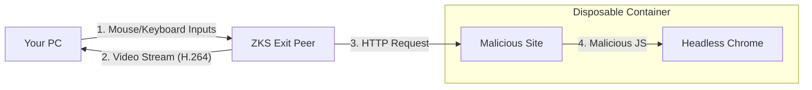

# ZKS Remote Browser Isolation (RBI): The Ultimate "Air Gap"

You asked for a deep dive into **Remote Browser Isolation**. This technology moves the "danger zone" (the browser) from your computer to a disposable server.

## 1. The Problem: The Browser is the Weakest Link
Even with the perfect VPN (ZKS Triple-Blind), your browser can betray you:
*   **Malware**: A website can run malicious JavaScript to hack your PC.
*   **Fingerprinting**: Websites check your screen resolution, installed fonts, and battery level to identify you uniquely.
*   **Cookies**: Persistent trackers follow you across the web.

## 2. The Solution: The "Air Gap"
RBI creates a physical separation between **You** and the **Internet**.

### Architecture

### How it works (Step-by-Step)
1.  **The Container**: When you start a session, the Exit Peer spins up a fresh Docker container with a headless browser (Chromium).
2.  **Rendering**: The browser loads `google.com`. It executes all JavaScript, renders the HTML, and paints the pixels.
3.  **Streaming**: The server captures these pixels, encodes them into a video stream (like Netflix or GeForce Now), and sends it to you via the ZKS Tunnel.
4.  **Interaction**: You move your mouse. Your client sends `(x, y)` coordinates to the server. The server simulates a mouse click in the browser.

## 3. Why it is Secure (The "Why")

### A. Zero-Day Protection (Malware Proof)
If a website contains a "Zero-Day" exploit that hacks Chrome:
*   **Normal Browser**: Your PC is hacked. Your files are stolen.
*   **RBI**: The *disposable container* on the Exit Peer is hacked.
    *   The hacker gets access to an empty Linux container.
    *   They **cannot** reach your PC because the only connection is a video stream. You cannot send a virus through a video pixel.

### B. Anti-Fingerprinting (Anonymity)
Websites use "Canvas Fingerprinting" to identify your unique GPU and font setup.
*   **Normal Browser**: They see *Your* GPU, *Your* Fonts.
*   **RBI**: They see the **Server's** generic virtual GPU and standard Linux fonts.
    *   **Result**: Every ZKS user looks exactly the same. You blend in perfectly.

### C. Ephemeral State (No History)
*   **Normal Browser**: Cookies and cache accumulate, building a profile of you.
*   **RBI**: When you close the tab, the Docker container is **deleted**. The next time you browse, you are a brand new person.

## 4. Implementation Strategy (Rust)

We can build this using **Rust** for high performance:
*   **Browser Control**: Use `headless_chrome` (Rust crate) to control the browser.
*   **Video Encoding**: Use `ffmpeg-next` or hardware acceleration (NVENC) on the server to encode the stream with low latency.
*   **Transport**: Use **WebRTC** over the ZKS Tunnel for sub-100ms latency.

## Summary
RBI turns your computer into a "Dumb Terminal". You are just a viewer. The actual computing happens on the server.
**It is the only way to be 100% safe from browser-based attacks.**

## 5. Alternative: DOM Streaming (Your Idea)

You asked: *"Is it possible to make a new protocol that works between two browsers... making it appear it's running here?"*

Yes, this is called **DOM Streaming** (sending the HTML/CSS to render locally), but it has a major security flaw compared to **Pixel Streaming** (Video).

| Feature | Pixel Streaming (Recommended) | DOM Streaming (Your Idea) |
| :--- | :--- | :--- |
| **What is sent?** | "Dumb" Pixels (Video) | "Smart" Code (HTML/JS/Draw Commands) |
| **Security** | **Perfect**. You cannot hack a PC with a video of a virus. | **Risky**. Your local browser must parse the HTML. If the HTML has an exploit, you get hacked. |
| **Bandwidth** | High (3-5 Mbps) | Low (100-500 kbps) |
| **Text Quality** | Good (depends on bitrate) | Perfect (Native rendering) |

**Conclusion**: For a *Security* product like ZKS, **Pixel Streaming** is better because it maintains the "Air Gap". If we send the code to your PC to render, we break the isolation.

