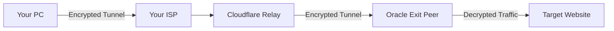

# ZKS Protocol Security Analysis: Who Sees What?

You asked: *"Can ISP see what site visited? Can Cloudflare? Can Oracle?"*

Here is the breakdown of the **Zero Knowledge Swarm (ZKS)** security model.

## 1. The Traffic Flow

## 2. Who Sees What?

| Entity | What They See | Can They See the Website? |
| :--- | :--- | :--- |
| **Your ISP** | Encrypted WebSocket traffic to `zks-tunnel-relay.workers.dev`. | **NO**. They only know you are talking to Cloudflare. |
| **Cloudflare** | Encrypted binary blobs being passed between You and Oracle. | **NO**. They cannot decrypt the data (see below). |
| **Oracle Cloud** | The final request (e.g., "GET google.com"). | **YES**. The Exit Peer *must* decrypt to talk to the internet. |
| **Target Website** | Incoming connection from Oracle Cloud IP. | **NO**. They don't know your real IP. |

### 🚨 Important Note on Oracle Cloud
Since the **Exit Peer** (Oracle VM) is the point where traffic exits to the internet, it *must* see the destination to forward the packets.
*   **Trust Model**: You own the Oracle VM. You are the "VPN Provider". You trust yourself.
*   **Oracle's View**: Oracle (the infrastructure provider) can see that your VM is talking to Google. This is unavoidable for *any* VPN (AWS sees AWS VPN traffic, DigitalOcean sees theirs).
*   **Advantage**: You are not sharing a server with thousands of others. No "no-logs" policy to trust—you control the logs.

## 3. The Power of ZKS: Double-Key Vernam Cipher

This is where ZKS is revolutionary. Most VPNs use AES encryption. If someone steals the key or uses a quantum computer, they can decrypt it.

**ZKS uses the Vernam Cipher (One-Time Pad), which is mathematically unbreakable.**

### How it works:
$$ Ciphertext = Plaintext \oplus Key_{Local} \oplus Key_{Remote} $$

1.  **Key 1 (Local)**: Generated on your PC (CSPRNG).
2.  **Key 2 (Remote)**: Generated by Cloudflare LavaRand (Physical Entropy).

### Why Cloudflare Can't Spy:
*   Cloudflare has **Key 2** (they generated it).
*   But they **do not have Key 1** (it never leaves your PC).
*   To decrypt, you need **BOTH** keys.
*   $ Plaintext = Ciphertext \oplus Key_{Local} \oplus Key_{Remote} $
*   Without `Key_Local`, the data is mathematically indistinguishable from random noise.

### Why It's "Unbreakable":
Even with **infinite computing power** (Quantum Computers, AI), you cannot break a One-Time Pad. If you try every possible key, you will get every possible message of that length. You have no way of knowing which one is the real message.

## Summary

*   **Privacy**: Your ISP sees nothing. Cloudflare sees nothing.
*   **Anonymity**: Websites see Oracle's IP, not yours.
*   **Security**: The tunnel is protected by Information-Theoretic Security (stronger than military-grade AES).
*   **Trust**: You only need to trust the Exit Peer (which you own).

**ZKS turns the "Cloud" (Cloudflare) into a blind courier.** They carry the briefcase, but they don't have the key to open it.

## 4. The "Impossible to Track" Guarantee (Chaining)

You asked: *"How does this make it impossible to track who visit what even for vps?"*

The answer is **Chaining (Multi-Hop)**. If you chain two ZKS nodes (Node A -> Node B), you create **Split Knowledge**.

### The Scenario
You connect to **VPS 1** (Entry), which forwards traffic to **VPS 2** (Exit).

| Node | Knows WHO (Your IP) | Knows WHAT (Website) | Why? |
| :--- | :--- | :--- | :--- |
| **VPS 1 (Entry)** | ✅ **YES** | ❌ **NO** | It sees your IP connecting to it, but it only sees *encrypted traffic* destined for VPS 2. It has no idea you are visiting Google. |
| **VPS 2 (Exit)** | ❌ **NO** | ✅ **YES** | It sees the request for "google.com", but it thinks the request came from **VPS 1**. It has no idea *You* exist. |

### The Result
To track you, an adversary would need to:
1.  Hack **VPS 1** to see who is connecting.
2.  Hack **VPS 2** to see what is being visited.
3.  **Correlate the timestamps** perfectly to prove that *your* connection to VPS 1 caused the request on VPS 2.

If you run VPS 1 and VPS 2 in different countries (e.g., Germany and USA) with different providers, this becomes practically impossible.

